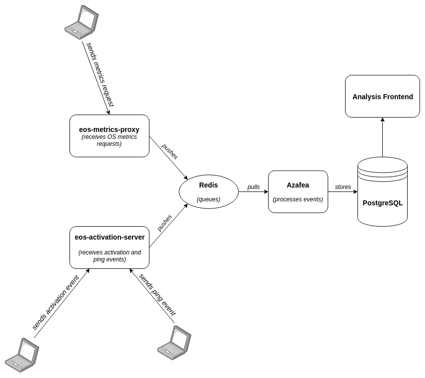

==================================
Welcome to Azafea's documentation!
==================================

Azafea is part of the server backend for the Endless usage metrics gathering
and processing.

Azafea is responsible for processing the raw events and storing the result in
PostgreSQL, where they can be queried and visualized.

.. toctree::
   :maxdepth: 2
   :caption: Contents:
